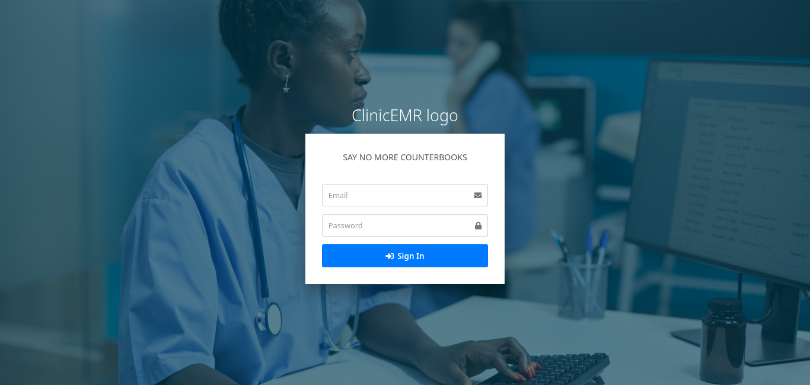
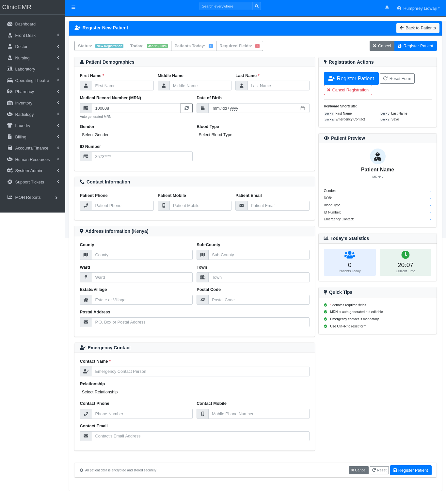
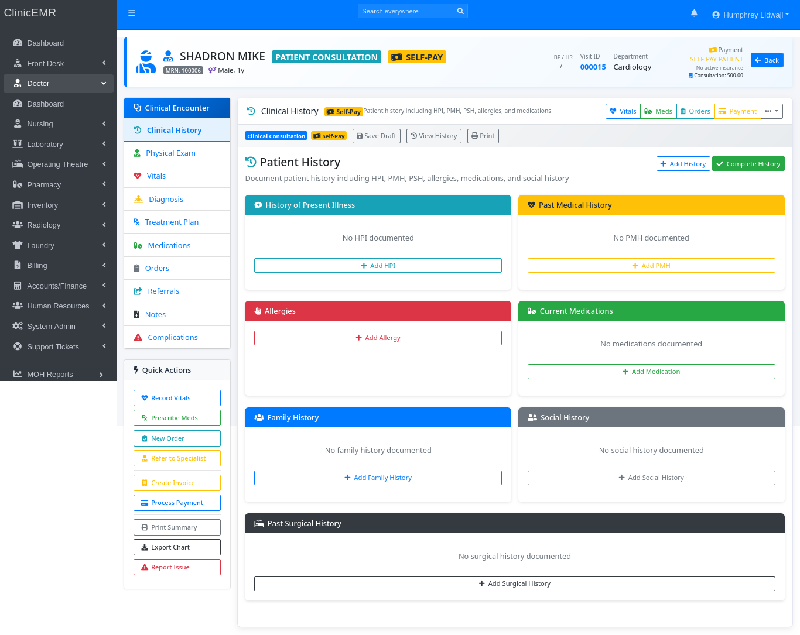

# 🏥 ClinicEMR

**ClinicEMR** is a **procedural PHP-based Electronic Medical Records (EMR) system** built for **real-world Kenyan clinics and hospitals**.

Designed and developed in a **live hospital environment**, ClinicEMR focuses on **practical workflows, performance, and reliability**, not demos.

---

## 🌍 Live Demo

> 🚧 Demo environment coming soon

- 🔗 **Demo URL:** `https://demo.clinicemr.example`
- 👤 **Username:** demo@clinicemr
- 🔑 **Password:** demo123

  ### 🧍 System Login Page

> ⚠️ Demo data is anonymized and reset periodically.

---

## 📸 Screenshots & UI Preview

> Replace image paths once you upload screenshots to `/screenshots/`

### 🧍 Patient Registration

### 🩺 Visit & Consultation

### 💊 Pharmacy Billing

### 🧾 Invoice & Billing

### 📦 Inventory Management

### 🔐 Roles & Permissions

---

## 🚑 Why ClinicEMR?

Most EMR systems fail because they ignore **how clinics actually work**.

ClinicEMR is built around:
- 🇰🇪 Kenyan clinic & hospital procedures
- 🏥 OPD, IP & Emergency workflows
- ⚙️ Low-resource & on-prem deployments
- 🔐 Accountability, audits & security

> Built to run where **patients are seen daily**.

---

## ✨ Key Features

### 🧍 Patient Management
- Patient registration & demographics
- Visit-based workflow
- OPD / IP / Emergency routing
- Visit lifecycle tracking

### 🩺 Clinical Workflow
- Consultations & clinical notes
- Diagnosis & treatment
- Medication orders
- Procedure tracking

### 💊 Pharmacy
- Drug catalog & pricing
- Pharmacy billing
- Automatic stock deduction
- Pharmacy sales reports

### 🧾 Billing & Invoicing
- Service-based billing
- Itemized invoices
- NHIF-ready billing structure
- Payment tracking & financial reports

### 📦 Inventory & Procurement
- Stock on hand
- Stock movement logs
- Reorder alerts
- Procurement & requisitions

### 👥 HR & Access Control
- Staff & user management
- Role-Based Access Control (RBAC)
- Fine-grained permissions
- Full audit trails

### 📊 Reports & Audits
- Clinical reports
- Financial reports
- HMIS-ready data outputs
- User activity logs

---

## 🧠 System Design Philosophy

- Procedural PHP for **clarity & performance**
- Minimal dependencies
- Optimized for **Linux on-prem servers**
- Handles slow networks & power interruptions
- Designed for **long-term maintainability**

---

## 🛠️ Tech Stack

### Backend
- PHP (Procedural)

### Database
- MySQL / MariaDB

### Server
- Linux (Debian / Ubuntu)
- Nginx or Apache

### Frontend
- HTML5
- Bootstrap
- JavaScript (AJAX)

---

## 📂 Project Structure (High-Level)

## 🚀 Installation

### Requirements
- PHP 8.x
- MySQL / MariaDB
- Nginx or Apache
- Linux server (recommended)

### Quick Setup
1. Clone repository  
2. Import database schema  
3. Configure \`config.php\`  
4. Set write permissions for:
   - \`/uploads\`
   - \`/screenshots\`
   - \`/logs\` (if applicable)
5. Access system via browser

> 📘 Detailed installation guide coming soon.

---

## ⚠️ Production Deployment Notes

- Recommended for **on-prem hospital servers**
- Schedule **daily database backups**
- Enforce **Linux user permissions**
- Enable audit logging
- Secure uploads directory

---

## 🧩 Roadmap

- [ ] ICD-11 integration
- [ ] NHIF claims automation
- [ ] REST API for integrations
- [ ] Performance & memory optimization
- [ ] UI/UX refinements
- [ ] Extended documentation

---

## ❤️ Support & Donations

ClinicEMR is developed and maintained through **personal time and real hospital deployments**.

If this project helps you, your clinic, or your organization, you can support continued development through a donation:

### 💳 PayPal  
👉 [Donate via PayPal](https://www.paypal.com/paypalme/lidwaji7)  

### 📱 M-Pesa (Kenya)  
Send your donation to this send via M-Pesa Mobile:  
**Phone Number:** \`+254798530739\`  

---

## 🤝 Contributing

ClinicEMR welcomes:
- Healthcare developers
- Linux system administrators
- PHP contributors
- Kenyan health IT innovators

Ways to contribute:
- Fork the repo
- Submit pull requests
- Open issues
- Suggest improvements

---

## 👨‍💻 Author

**Humphrey Lidwaji**  
Linux System Administrator | PHP Developer  
Core Developer – ClinicEMR (OpenSolutions)

📧 Email: **humphreylidwaji@proton.me**  
💼 GitHub: https://github.com/HumphreyLidwaji

---

## 📜 License

This project is released under a custom open-source license.  
Commercial or hospital deployment may require authorization.

---

> *ClinicEMR — built for clinics that cannot afford system failure.*
